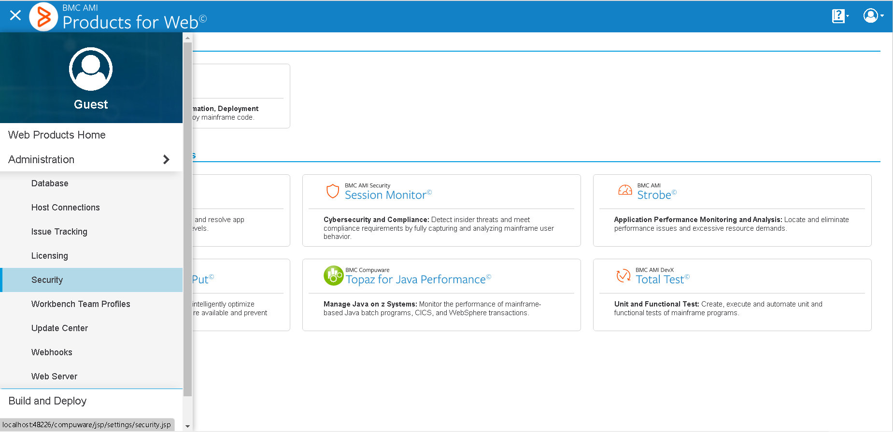
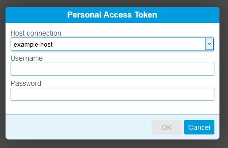
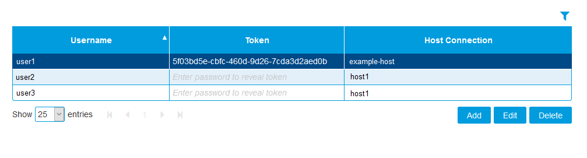
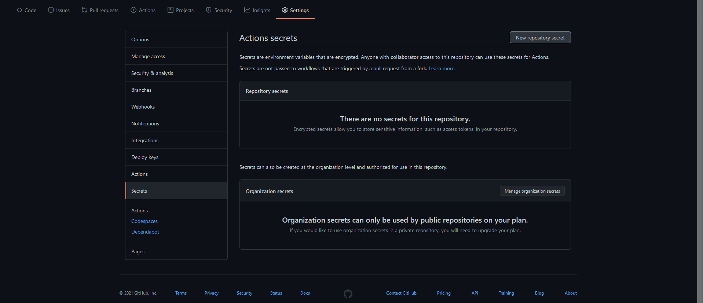
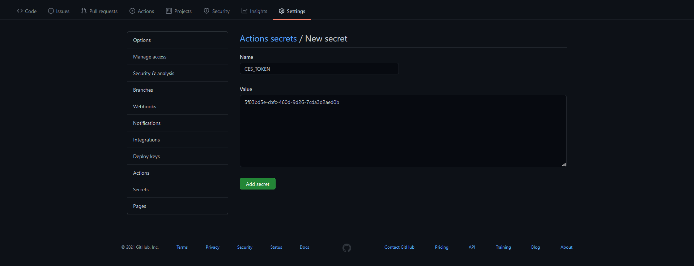

# Code Pipeline Deployment List

The Code Pipeline Deployment List action allows your GitHub Actions workflow to retrieve deployment list from your instance of BMC AMI DevX Code Pipeline(Code Pipeline) using various optional filter criteria. Potentially, large amounts of data may be returned from this action. This action has a limit of 5000 records. You should attempt to set as many filter parameters as possible to reduce the number of items returned.

## Example usage

The following example retrieves all the deployments using default filter : priorWeek=true

``` yaml
on: [push]

jobs:
  run-ispw-deployment-list:
    runs-on: [self-hosted]
    name: A job to get deployment list of Code Pipeline.
    steps:
      - name: Deployment List
        uses: bmc-compuware/code-pipeline-deployment-list@v1.0.0
        id: deploymentlist
        with:
          ces_url: 'http://CES:48080/'
          ces_token: ${{ secrets.CES_TOKEN }}
          srid: 'CW09'
```

The following example will retrive deployment list based on various below filter criterias

``` yaml
on: [push]

jobs:
  run-ispw-deployment-list:
    runs-on: [self-hosted]
    name: A job to get deployment list of Code Pipeline.
    steps:
      - name: Deployment List
        uses: bmc-compuware/code-pipeline-deployment-list@v1.0.0
        id: deploymentlist
        with:
          ces_url: 'http://CES:48080/'
          ces_token: ${{ secrets.CES_TOKEN }}
          srid: 'CW09'
          todaysDate: "false"
          priorWeek: "false"
          startDate: "2023-08-09"
          endDate: "2023-08-14"
          requestId: "245274"
          setId: "S000385216"
          environment: "PLAY"
          status: "Completed"
```

## Inputs

| Input name | Required | Description |
| ---------- | -------- | ----------- |
| `ces_url` | Required | The URL to use when connecting to CES |
| `ces_token` | Required | The token to use when authenticating the request to CES |
| `srid` | Required | The SRID of the Code Pipeline instance to connect to |
| `todaysDate` | Optional |True/False value indicating whether or not to include todays date deployments. This field is not case sensitive. |
| `priorWeek` | Optional | True/False value indicating whether or not to include prior week deployments. This field is not case sensitive. The default value is true. |
| `startDate` | Optional | Deployment start date/time in yyyy-mm-dd format when the set will be dispatched for execution. |
| `endDate` | Optional | Deployment end date/time in yyyy-mm-dd format. |
| `requestId` | Optional | A unique numerical id assigned to this deployment request. Wildcard * is not supported. |
| `setId` | Optional | The set ID you want information on. This field is case sensitive. Wildcard * is only supported. |
| `environment` | Optional | The logical execution environment where the components will be deployed for this request. This field is not case sensitive. Wildcard * is only supported. |
| `status` | Optional | The overall current status of the deploy request, which may be Planned, Confirmed, Staged, Implemented, Completed, Failed, or Terminated. This field is not case sensitive. Wildcard * is only supported. |

## Outputs

| Output name | Output type | Description |
| ----------- | ----------- | ----------- |
| `output_json` | JSON | the JSON output from build |

## Setup

### Create a token in Common Enterprise Services (CES)

In order to use this action, you must have an instance of the CES product installed on one of your runners. Once that is complete, you will need to open CES in your web browser and create a token to be used during requests. To set up a new host connection, go to the hamburger menu in the upper left corner and select Host Connections.



On the Host Connection Settings page, click "Add." Set up the host connection to be used for Code Pipeline and click OK when finished.

Then, go back to the menu and select Security. On the Security page, click Add and the Personal Access Token dialog will come up.



On the Personal Access Token dialog, select the host that you want to create a token for, and enter in the mainframe username and password.

Once done, there will be a new token in the table on the Security page



### Save the token as a GitHub Secret

From the Security page in CES, copy the token. In GitHub go to Settings > Secrets and click the button for New Repository Secret.



On the New Secret page, paste the token that was copied earlier and click the Add secret button. Make a note of the name you give the secret so that you can easily use it in your workflow script.



### Fill in the workflow script

Use the examples above to fill in a workflow script using the Code Pipeline Deployment List action. 

### Troubleshooting

To enable debug logging in your GitHub actions workflow, see the guide [here](https://docs.github.com/en/actions/managing-workflow-runs/enabling-debug-logging).

### Developers

For information about contributing to the Code Pipeline Deployment List action, see [Developing on the Code Pipeline Deployment List GitHub action](./CONTRIBUTING.md)

## See also
- [License](LICENSE.txt)
